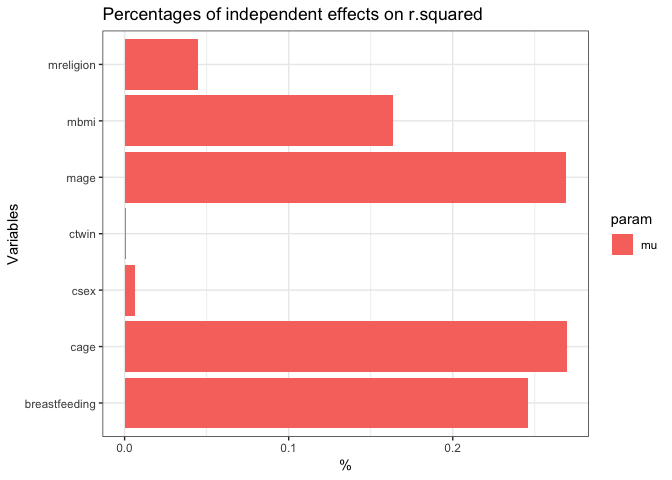
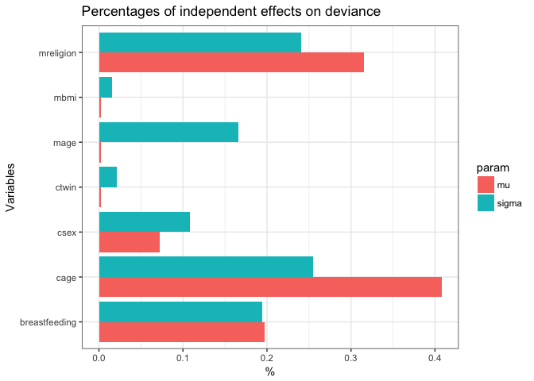

<!-- README.md is generated from README.Rmd. Please edit that file -->
ghp
===

GHP stands for General Hierarchical Partitioning. `ghp` is an implementation of the technique of hierarchical partitioning first mentioned by Chevan and Sutherland (1991). This method fits all possible models for a set of covariates and then extracts a goodness of fit (e.g. *R*<sup>2</sup> for linear models) to obtain independent and joint contributions of the independent variables on the selected figure.

This package is an extension of the `hier.part` R package, developed by C. Walsh and R. Mac Nally in 2003. While `hier.part` is fast and simple at what it does, it is limited in the range of possible models as well as goodness of fit figures. Specifically, the motivation of this package is the ability to do deviance partitioning.

Installation
------------

You can install ghp from github with:

``` r
# install.packages("devtools")
devtools::install_github("Stan125/ghp")
```

Example: Partitioning of rsquared in linear regression
------------------------------------------------------

Just call the ghp function with the name of the dependent variable (arg: `dep`) and a data.frame with all relevant variables to obtain the independent and joint effects of the explanatory covariates.

``` r
india <- ghp::india
results_lm <- ghp(depname = "stunting", india, method = "lm", gof = "r.squared")
results_lm
#> $actual
#>                          I             J        Total
#> cage          1.836518e-02  5.866361e-03 2.423154e-02
#> csex          3.244890e-03 -3.470725e-05 3.210182e-03
#> breastfeeding 8.920133e-03  4.418101e-03 1.333823e-02
#> ctwin         1.067918e-04  1.565171e-04 2.633089e-04
#> mage          1.137771e-04 -8.484668e-05 2.893047e-05
#> mbmi          9.587312e-05 -8.941648e-05 6.456648e-06
#> mreligion     1.420427e-02  1.437252e-03 1.564152e-02
#> 
#> $perc
#>                        I          J
#> cage          40.7653840 50.2719150
#> csex           7.2027171 -0.2974246
#> breastfeeding 19.8001178 37.8610212
#> ctwin          0.2370470  1.3412769
#> mage           0.2525524 -0.7270956
#> mbmi           0.2128106 -0.7662566
#> mreligion     31.5293711 12.3165636
#> 
#> attr(,"npar")
#> [1] 1
#> attr(,"gof")
#> [1] "r.squared"
```

The first dataframe captures the actual mean influence of the variable on the goodness-of-fit. Also, joint effects are calculated. The second dataframe shows the percentage influence. We can see that `cage` has the highest influence with (~43%).

Example: Partitioning of deviance in gamlss models
--------------------------------------------------

It is now possible to do deviance partitiong of gamlss models. Gamlss models can model multiple parameters of a distribution. `ghp` can handle up to two modeled parameters, so you can find out what influence covariates have on the second modeled parameter (e.g. the variance).

``` r
results_gamlss <- ghp("stunting", india, method = "gamlss", 
                      gof = "deviance", npar = 2)
#> Warning in is.na(data): is.na() applied to non-(list or vector) of type
#> 'NULL'
#> Warning in RS(): Algorithm RS has not yet converged

#> Warning in RS(): Algorithm RS has not yet converged

#> Warning in RS(): Algorithm RS has not yet converged
results_gamlss
#> $mu
#> $mu$actual
#>                         I        J    Total
#> cage          -7.61381060 7362.526 7354.912
#> csex          -1.34759816 7364.892 7363.545
#> breastfeeding -3.68367916 7363.092 7359.409
#> ctwin         -0.04358676 7364.784 7364.740
#> mage          -0.04754386 7364.883 7364.835
#> mbmi          -0.03978509 7364.884 7364.844
#> mreligion     -5.89338185 7364.355 7358.462
#> 
#> $mu$perc
#>                        I        J
#> cage          40.7823311 14.28246
#> csex           7.2182245 14.28705
#> breastfeeding 19.7311217 14.28356
#> ctwin          0.2334665 14.28684
#> mage           0.2546621 14.28703
#> mbmi           0.2131034 14.28704
#> mreligion     31.5670907 14.28601
#> 
#> 
#> $sigma
#> $sigma$actual
#>                        I        J    Total
#> cage          -66.432641 7366.900 7300.467
#> csex          -28.105884 7379.226 7351.120
#> breastfeeding -50.695336 7376.408 7325.713
#> ctwin          -5.458284 7366.134 7360.676
#> mage          -43.138047 7407.513 7364.375
#> mbmi           -4.116063 7367.027 7362.910
#> mreligion     -62.623189 7387.658 7325.034
#> 
#> $sigma$perc
#>                       I        J
#> cage          25.495177 14.26288
#> csex          10.786332 14.28674
#> breastfeeding 19.455595 14.28129
#> ctwin          2.094752 14.26140
#> mage          16.555298 14.34151
#> mbmi           1.579641 14.26312
#> mreligion     24.033205 14.30307
#> 
#> 
#> attr(,"npar")
#> [1] 2
#> attr(,"gof")
#> [1] "deviance"
```

Example: Variable grouping
--------------------------

Since 0.3.0 you can specify variable groups. The partitioning is now not happening with specific variables, but by testing all group combinations. In the given `ghp::india` dataset, which captures the nutrition of children in india we can now divide all covariates into to groups: those that give information about the child, and those that give information about the mother. Let's try that out:

``` r
# Specifying the groups should happen in a data.frame 
groupings <- data.frame(varnames = colnames(india), 
                        groups = c("0", "child", "child", "mother", 
                                   "child", "mother", "mother", "mother"))
results_groups <- ghp(depname = "stunting", india, method = "lm", gof = "r.squared",
                      group_df = groupings)
results_groups
#> $actual
#>                 I           J      Total
#> child  0.02180910 0.006937903 0.02874700
#> mother 0.02324181 0.006937903 0.03017972
#> 
#> $perc
#>               I  J
#> child  48.40989 50
#> mother 51.59011 50
#> 
#> attr(,"npar")
#> [1] 1
#> attr(,"gof")
#> [1] "r.squared"
```

We can now see that both groups have almost the same amount of influence on the *R*<sup>2</sup>.

Bar Plots
---------

To get a bar plot of the percentage independent effects, use `plot_ghp()`:

``` r
plot_ghp(results_lm)
```



``` r
plot_ghp(results_gamlss)
```



Comparison with hier.part
-------------------------

Unfortunately, `ghp` is slower than the original `hier.part` package, mostly because it does not rely on C code. A quick time comparison for the same problem:

``` r
system.time(hier.part::hier.part(india$stunting, dplyr::select(india, -stunting), gof = "Rsqu", barplot = FALSE))
#> Loading required package: gtools
#>    user  system elapsed 
#>   0.428   0.012   0.452
system.time(ghp::ghp("stunting", india, method = "lm", gof = "r.squared"))
#>    user  system elapsed 
#>   3.978   0.028   4.020
```

This README.Rmd was run on:

``` r
date()
#> [1] "Wed Oct 18 11:26:13 2017"
```
