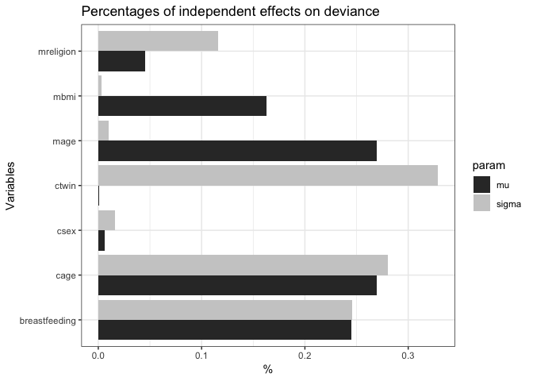

<!-- README.md is generated from README.Rmd. Please edit that file -->
ghp
===

[](https://travis-ci.org/Stan125/ghp)

GHP stands for General Hierarchical Partitioning. `ghp` is an implementation of the technique of hierarchical partitioning first mentioned by Chevan and Sutherland (1991). This method fits all possible models for a set of covariates and then extracts a goodness of fit (e.g. *R*<sup>2</sup> for linear models) to obtain independent and joint contributions of the independent variables on the selected figure.

This package is an extension of the `hier.part` R package, developed by C. Walsh and R. Mac Nally in 2003. While `hier.part` is fast and simple at what it does, it is limited in the range of possible models as well as goodness of fit figures. Specifically, the motivation of this package is the ability to do deviance partitioning.

Installation
------------

You can install ghp from github with:

``` r
# install.packages("devtools")
devtools::install_github("Stan125/ghp")
```

Example: Partitioning of rsquared in linear regression
------------------------------------------------------

Just call the ghp function with the name of the dependent variable (arg: `dep`) and a data.frame with all relevant variables to obtain the independent and joint effects of the explanatory covariates.

``` r
india <- ghp::india
results_lm <- ghp(depname = "stunting", india, method = "lm", gof = "r.squared")
results_lm
#> $results
#> # A tibble: 7 x 7
#>             var param indep_effects joint_effects total_effects
#>           <chr> <chr>         <dbl>         <dbl>         <dbl>
#> 1          cage    mu  1.836518e-02  5.866361e-03  2.423154e-02
#> 2          csex    mu  3.244890e-03 -3.470725e-05  3.210182e-03
#> 3 breastfeeding    mu  8.920133e-03  4.418101e-03  1.333823e-02
#> 4         ctwin    mu  1.067918e-04  1.565171e-04  2.633089e-04
#> 5          mage    mu  1.137771e-04 -8.484668e-05  2.893047e-05
#> 6          mbmi    mu  9.587312e-05 -8.941648e-05  6.456648e-06
#> 7     mreligion    mu  1.420427e-02  1.437252e-03  1.564152e-02
#> # ... with 2 more variables: indep_perc <dbl>, joint_perc <dbl>
#> 
#> $npar
#> [1] 1
#> 
#> $method
#> [1] "lm"
#> 
#> $gof
#> [1] "r.squared"
#> 
#> attr(,"class")
#> [1] "part"
```

The first dataframe captures the actual mean influence of the variable on the goodness-of-fit. Also, joint effects are calculated. The second dataframe shows the percentage influence. We can see that `cage` has the highest influence with (~43%).

Example: Partitioning of deviance in gamlss models
--------------------------------------------------

It is now possible to do deviance partitiong of gamlss models. Gamlss models can model multiple parameters of a distribution. `ghp` can handle up to two modeled parameters, so you can find out what influence covariates have on the second modeled parameter (e.g. the variance).

``` r
results_gamlss <- ghp("stunting", india, method = "gamlss", 
                      gof = "deviance", npar = 2)
results_gamlss
#> $results
#> # A tibble: 14 x 7
#>              var param indep_effects joint_effects total_effects
#>            <chr> <chr>         <dbl>         <dbl>         <dbl>
#>  1          cage    mu   -7.61381060      7362.526      7354.912
#>  2          csex    mu   -1.34759816      7364.892      7363.545
#>  3 breastfeeding    mu   -3.68367916      7363.092      7359.409
#>  4         ctwin    mu   -0.04358676      7364.784      7364.740
#>  5          mage    mu   -0.04754386      7364.883      7364.835
#>  6          mbmi    mu   -0.03978509      7364.884      7364.844
#>  7     mreligion    mu   -5.89338185      7364.355      7358.462
#>  8          cage sigma  -66.43264056      7366.900      7300.467
#>  9          csex sigma  -28.10588430      7379.226      7351.120
#> 10 breastfeeding sigma  -50.69533567      7376.408      7325.713
#> 11         ctwin sigma   -5.45828383      7366.134      7360.676
#> 12          mage sigma  -43.13804748      7407.513      7364.375
#> 13          mbmi sigma   -4.11606275      7367.027      7362.910
#> 14     mreligion sigma  -62.62318946      7387.658      7325.034
#> # ... with 2 more variables: indep_perc <dbl>, joint_perc <dbl>
#> 
#> $npar
#> [1] 2
#> 
#> $method
#> [1] "gamlss"
#> 
#> $gof
#> [1] "deviance"
#> 
#> attr(,"class")
#> [1] "part"
```

Example: Variable grouping
--------------------------

Since 0.3.0 you can specify variable groups. The partitioning is now not happening with specific variables, but by testing all group combinations. In the given `ghp::india` dataset, which captures the nutrition of children in india we can now divide all covariates into to groups: those that give information about the child, and those that give information about the mother. Let's try that out:

``` r
# Specifying the groups should happen in a data.frame 
groupings <- data.frame(varnames = colnames(india), 
                        groups = c("0", "child", "child", "mother", 
                                   "child", "mother", "mother", "mother"))
results_groups <- ghp(depname = "stunting", india, method = "lm", gof = "r.squared",
                      group_df = groupings)
results_groups
#> $results
#> # A tibble: 2 x 7
#>      var param indep_effects joint_effects total_effects indep_perc
#>    <chr> <chr>         <dbl>         <dbl>         <dbl>      <dbl>
#> 1  child    mu    0.02180910   0.006937903    0.02874700  0.4840989
#> 2 mother    mu    0.02324181   0.006937903    0.03017972  0.5159011
#> # ... with 1 more variables: joint_perc <dbl>
#> 
#> $npar
#> [1] 1
#> 
#> $method
#> [1] "lm"
#> 
#> $gof
#> [1] "r.squared"
#> 
#> attr(,"class")
#> [1] "part"
```

We can now see that both groups have almost the same amount of influence on the *R*<sup>2</sup>.

Bar Plots
---------

To get a bar plot of the percentage independent effects, use `plot_ghp()`:

``` r
plot_ghp(results_lm)
```


``` r
plot_ghp(results_gamlss)
```



Comparison with hier.part
-------------------------

Since `0.4.0`, `ghp` is almost as fast as its counterpart `hier.part`, because the core partitioning was written with C++. A quick comparison:

``` r
system.time(hier.part::hier.part(india$stunting, dplyr::select(india, -stunting), gof = "Rsqu", barplot = FALSE))
#> Loading required package: gtools
#>    user  system elapsed 
#>   0.422   0.017   0.493
system.time(ghp::ghp("stunting", india, method = "lm", gof = "r.squared"))
#>    user  system elapsed 
#>   0.578   0.007   0.591
```

This README.Rmd was run on:

``` r
date()
#> [1] "Tue Feb  6 17:17:45 2018"
```
